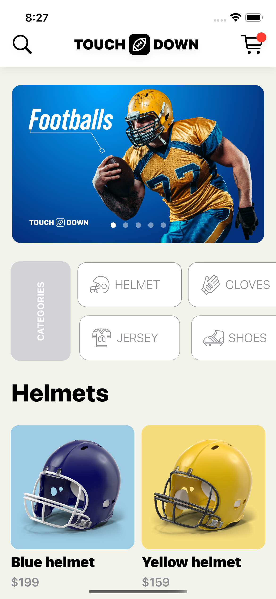
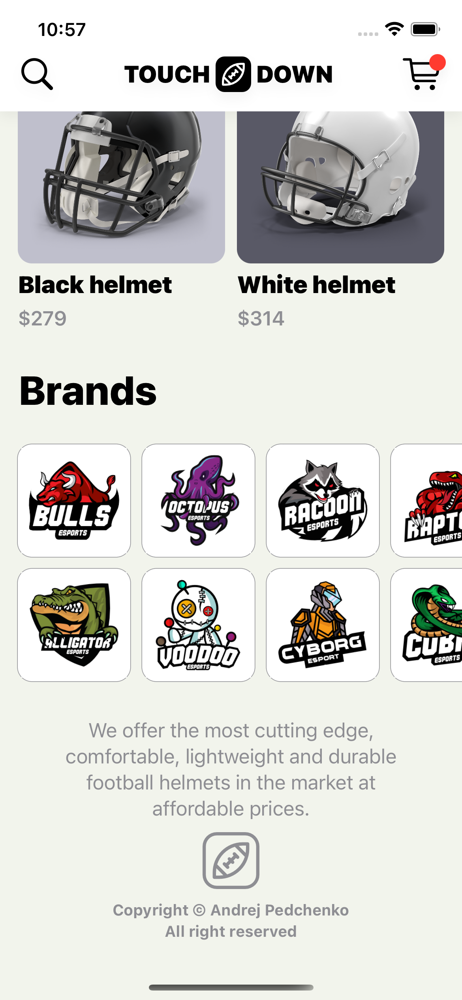

# Touchdown - example `swift` project

### Not resolved project problems for iOS 15
* `ContentView` file:
  * `FeaturedTabView` wrong slider size.
  * `CategoryGridView` grid items in the same columns with different width.

## Screenshots `iPhone 13 Pro`

---

---

